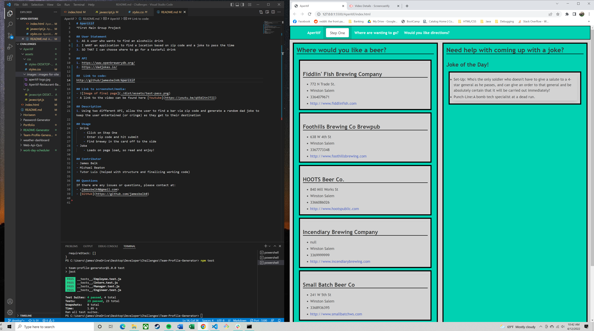

# Aperitif

## User Statement
1. AS A user who wants to find an alcoholic drink
2. I WANT an application to find a location based on zip code and a joke to pass the time
3. SO THAT I can choose where to go for a tasteful drink

## API Used
1. https://www.openbrewerydb.org/
2. https://dadjokes.io/

##  Link to code:
http://github/jamesbelk0/Aperitif

## Link to screenshot/media:
- 
- A link to the video can be found here [Youtube](https://youtu.be/qX5dltnJTII)

## Description
1. A centralized app that uses a user inputted zip-code to find and show any bars or breweries located in the area. This information is then presented in the UI as individual cards with any information the user might need to locate the establishment. On the right side is a randomized dad joke to entertain the user at the bar or use as an ice breaker. 

## Usage
- Drink
    - Click on Step One
    - Enter zip code and hit submit
    - Find brewey in the card off to the side
- Joke
    - Loads on page load, so read and enjoy!

## Contributor
- James Belk
- Michael Beaton

## Questions
If there are any issues or questions, please contact at:
- <jamesbelk0@gmail.com>
- [GitHub](https://github.com/jamesbelk0)

